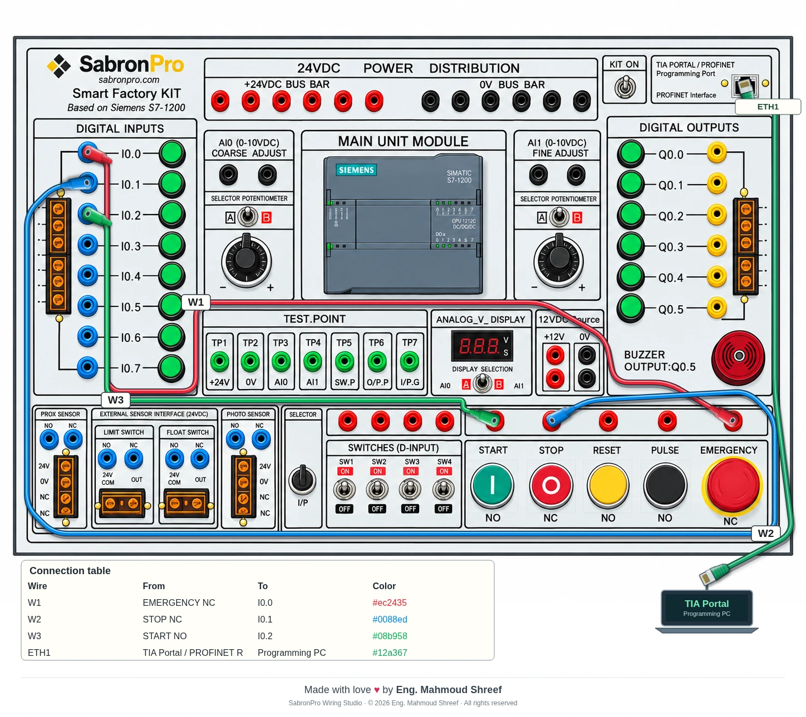

<div align="center">

# SabronPro Wiring Studio

### Interactive wiring • Panel controls • Experiment diagrams

**Made with love ♥ by Eng. Mahmoud Shreef**

[**Open the GitHub Pages demo**](https://eng-mahmoud-shreef.github.io/sabronpro-wiring-studio/) · [**Existing public demo**](https://sabronpro-kit-studio.eng-mahmoudshreef.chatgpt.site) · [**Download the standalone HTML**](SabronPro-Wiring-Studio.html) · [**Documentation**](#documentation)

**v1.1.0** · **Works offline** · **No backend** · **Proprietary / All rights reserved**

</div>

---

SabronPro Wiring Studio is a browser application for creating wiring experiments on the **SabronPro Smart Factory Kit**, based on the Siemens S7-1200. It keeps the supplied panel image fixed and places interactive sockets, controls, shaded patch leads and an editable connection table over it.

Use it to prepare training diagrams, explore contact behavior, correct socket positions and export illustrations for an experiment manual.

> **Demo scope:** this application simulates contacts and wired signals. It does not execute Siemens PLC programs or communicate with physical hardware. The Ethernet cable is a visual programming connection.

## Preview

### Example exported experiment: P01 + Ethernet

The image below is an **application-generated diagram export**, not a screenshot of the editor. It shows the three P01 patch leads, the RJ45 programming cable, the connection table and the author credit.



### Credits window

Actual application screenshot:

<p align="center">

</p>

## Features

| Area | What you can do |
| --- | --- |
| Banana patch leads | Click two sockets, drag between sockets, or choose endpoints from the Add cable dialog |
| Lead appearance | Shaded plugs, colored cables, highlights, shadows and wire labels |
| Routing | Auto-route around mapped keep-out zones, add bends and drag route handles |
| Bottom controls | Hold START, STOP, RESET or PULSE; latch and explicitly release Emergency |
| Switches & knobs | Operate toggles/selectors and adjust potentiometers |
| Contact simulation | Observe NO/NC behavior and wired input indicators |
| Calibration | Drag socket/control centers, enter X/Y, nudge with arrow keys and save/export the map |
| Ethernet | Attach an RJ45 cable to TIA Portal / PROFINET and move the programming-computer endpoint |
| Connection table | Edit title, size, style, location, labels and visible columns |
| Project storage | Automatic local recovery, named browser copies and portable JSON files |
| Editing | Undo/redo, lead properties, locking, hiding, notes and endpoint reconnection |
| Export | PNG at 1×/2×/4×, self-contained SVG and browser Print / Save as PDF |
| Authorship | Credit footer, Credits window, project metadata and signature on exported diagrams |

## Getting started

### Use the online demo

Open **[SabronPro Wiring Studio on GitHub Pages](https://eng-mahmoud-shreef.github.io/sabronpro-wiring-studio/)** in your browser. The demo is public. No project account or app installation is required. Your project data is stored locally in your browser rather than shared with other visitors.

The original public demo remains available at **https://sabronpro-kit-studio.eng-mahmoudshreef.chatgpt.site**.

### Use it offline — one file only

1. Download [`SabronPro-Wiring-Studio.html`](SabronPro-Wiring-Studio.html). On GitHub, open the file and use **Download raw file**.
2. Save it anywhere on your computer.
3. Double-click it to open it in Chrome, Edge or Firefox.

**You do not need the source folders, Node.js, npm, a server or an internet connection to use the standalone HTML.** The panel image and application code are embedded in it.

### Create your first experiment

1. Choose the **P01** template, or start a new blank project.
2. In **Design**, click the source socket and then the destination socket.
3. Select a lead to change its label, color, endpoints or route.
4. Switch to **Run** and hold START. Its connected digital input responds.
5. Try STOP and Emergency to inspect their normally-closed behavior.
6. Use **Export diagram** to create a clean image or vector diagram.

P01 demonstrates contact wiring; it does **not** implement a motor seal-in PLC program.

## Correct socket positions

The initial map follows the supplied clean image, but every position can be calibrated.

1. Select **Calibrate → Socket centers**.
2. Select a socket and drag its crosshair to the physical center in the image.
3. For precision, enter **X/Y** in Properties or use the arrow keys.
4. Select **Save calibration**.

Coordinates use the original **1448 × 1086** image pixels. Attached plugs follow their socket IDs automatically. The background image stays fixed.

**Save calibration** stores the map as a default for new projects on the same browser. **Export calibration** creates a portable backup, and **Download kit-definition.ts** produces a calibrated definition for source integration. Project JSON also contains its own calibration.

## Ethernet / TIA Portal

In **Design**, choose **Ethernet / TIA Portal**, or click the panel's RJ45 port.

- The cable attaches to the calibrated `TIA_PROFINET` port.
- Drag the programming computer or its plug to reposition the external endpoint.
- Edit cable color, lead label, computer label and notes in Properties.
- Auto-route the cable or add and move bends.
- Lock, hide or remove it as needed.
- The cable is included in saved projects, the connection table and diagram exports.

RJ45 connections are kept separate from banana patch leads and the electrical signal graph. This feature does **not** launch TIA Portal, establish a network or upload a PLC program.

## Save and move your work

**Save** keeps a named browser copy and downloads a `.sabronpro.json` project file.

To continue on another computer, open the standalone HTML or public demo and choose **Open → Open a project JSON file**. Wiring, control states, cable routes, Ethernet, table settings and calibration travel with that file.

Browser autosave is tied to that browser/address. Clearing browser data can remove it. Keep downloaded project and calibration backups. Saving a project does not modify the HTML file itself.

## Keyboard and pointer controls

| Action | Shortcut / interaction |
| --- | --- |
| Save project | Ctrl+S |
| Undo / redo | Ctrl+Z / Ctrl+Y |
| Fit canvas | F |
| Reset zoom | 1 |
| Zoom | Mouse wheel |
| Pan | Middle mouse drag or Space + drag |
| Cancel selection / pending connection | Escape |
| Delete selected cable | Delete |
| Nudge selected calibration center | Arrow keys; Shift + arrow = 10px |
| Add a lead bend | Double-click a banana lead, or use Add bend |
| Remove a bend | Double-click its route handle |
| Adjust potentiometer | Vertical drag; wheel over a selected knob |
| Release Emergency | Release Emergency button or right-click its cap |

## Build from source

Source modifications require Node.js; normal app use does not.

```bash
node build.mjs
```

The build has **no package dependencies to install**. It produces:

- `dist/index.html` — hosted application, using `dist/panel.png`;
- `SabronPro-Wiring-Studio.html` — self-contained offline application;
- `src/kit/kit-definition.js` — browser-compatible copy of the kit definition.

The implementation uses modular JavaScript, JavaScript-compatible TypeScript kit metadata, SVG, HTML and CSS. It is not a React/Vite project and does not require a backend.

## GitHub Pages deployment

The repository includes [`.github/workflows/pages.yml`](.github/workflows/pages.yml). Pushes to `main` build and publish the `dist` directory through GitHub Actions.

## Project structure

```text
src/
  app/          Editor UI, actions, pointer and keyboard interactions
  credits/      Author metadata and export signature
  experiments/  P01, switch, analog and blank templates
  export/       SVG, PNG and print exports
  kit/          Socket/control registry and calibration
  routing/      Obstacle-aware A* routing and curve generation
  simulation/   Contact signals, connectivity and validation
  storage/      Recovery, project JSON and browser copies
  wiring/       Banana leads, controls, table and RJ45 cable rendering
docs/           Guides and preview assets
dist/           Hosted static application
```

## Documentation

- [Architecture](docs/architecture.md)
- [Component map](docs/component-map.md)
- [Experiment and project format](docs/experiment-format.md)
- [Wire format](docs/wiring-format.md)
- [Routing](docs/routing.md)
- [Simulation](docs/simulation.md)
- [Credits and Ethernet](docs/credits-and-ethernet.md)
- [Unverified component details](docs/unresolved-components.md)

The registry contains **58 banana sockets, 23 screw-terminal points, one RJ45 programming port, and 36 control/indicator regions**. Some electrical terminal assignments cannot be verified from the panel image alone; see the unresolved-components document before treating the software as a pinout reference.

## Validation and limitations

The Ethernet feature is a **diagram feature only**. It does not establish a real PLC connection, open TIA Portal, or upload a PLC program.

Routing uses mapped geometry and keep-out zones, not OCR, and can require manual refinement. Buzzer response is visual only. A native Windows executable is not included.

## Credits and ownership

### Made with love ♥ by Eng. Mahmoud Shreef

Software and documentation credit: **Eng. Mahmoud Shreef**.

- Author name appears in the application footer and Credits window.
- Exported diagrams include a dedicated signature band.
- Project files contain author metadata.
- The source distribution includes the ownership notice in [`LICENSE`](LICENSE).

**© 2026 Eng. Mahmoud Shreef. All rights reserved.**

This is a public source repository distributed under a **proprietary notice**, not an open-source license. Public visibility does not grant permission to rebrand, sell, sublicense or claim authorship of the software. The public demo is intended for trying the application. Contact the owner for other permissions.

Manufacturer names, trademarks and third-party materials remain the property of their respective owners. Authorship notices are attribution, not a technical copy-protection mechanism.

[Author's GitHub profile](https://github.com/eng-Mahmoud-Shreef)
